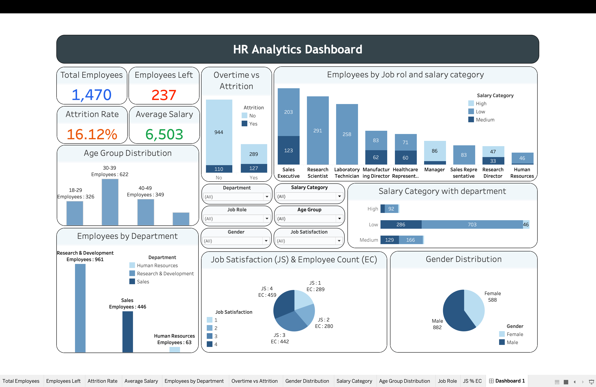

# HR Employee Attrition Analytics | MySQL + Tableau

An interactive **HR Analytics Dashboard** built using **MySQL** for data analysis and **Tableau** for visualization. This project analyzes employee attrition, salary distribution, job satisfaction, overtime impact, and workforce demographics to generate actionable business insights.
---

## 📊 Dashboard Preview

---

## Features

* **5 KPI Cards**

  * Total Employees
  * Employees Left
  * Attrition Rate
  * Average Salary
* Department-wise employee analysis
* Overtime vs Attrition (100% stacked bar)
* Job Role & Salary Category analysis
* Age Group & Gender distribution
* Job Satisfaction analysis
* Interactive filters for dynamic exploration

---

##  Tech Stack

| Tool        | Purpose                               |
| ----------- | ------------------------------------- |
| **MySQL**   | Data cleaning & SQL analysis          |
| **SQL**     | Business queries & calculated fields  |
| **Tableau** | Interactive dashboard & visualization |

---

## Key Business Insights

* **1,470** total employees analyzed
* **237** employees left the company
* Overall **Attrition Rate: 16.12%**
* **Sales** department has the highest attrition (**20.63%**)
* Employees working **Overtime** have a **30.53%** attrition rate compared to **10.44%** for employees who do not

---

## SQL Concepts Used

* `SELECT`, `WHERE`, `ORDER BY`
* `GROUP BY` & `HAVING`
* Aggregate Functions (`COUNT`, `SUM`, `AVG`)
* `CASE WHEN`
* Subqueries
* Window Functions (`DENSE_RANK`)
* Views & Calculated Columns

---

## Dashboard KPIs
| KPI             |      Value |
| --------------- | ---------: |
| Total Employees |  **1,470** |
| Employees Left  |    **237** |
| Attrition Rate  | **16.12%** |
| Average Salary  |  **6,503** |

---

## Project Objective
The objective of this project is to identify the key factors influencing employee attrition and present meaningful HR insights through an interactive Tableau dashboard. The analysis helps understand workforce demographics, overtime impact, salary distribution, and job satisfaction.

---

## Author
**Vedant Patil**
Aspiring Data Analyst | AIML Student

